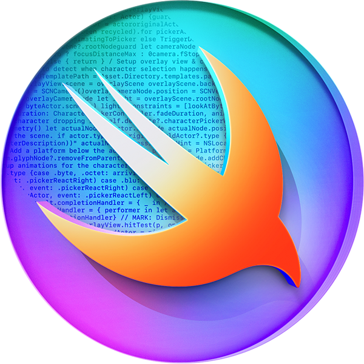

# Aditya Medhane - Portfolio 🚀

Welcome to the source code of my personal portfolio website. This project is a minimal, high-performance web application built with **Astro** and designed with a focus on aesthetics, speed, and modern web design principles (Glassmorphism, Micro-interactions).

<!--  You might want to replace this with a screenshot of your site later -->*

## ✨ Features

- **⚡ Blazing Fast**: Built with [Astro](https://astro.build/) for 0kb JavaScript by default (mostly).
- **🎨 Modern Design**: Custom Vanilla CSS with glassmorphism effects, smooth transitions, and a dark/light mode architecture.
- **📱 Responsive**: Fully responsive layout that looks great on mobile, tablet, and desktop.
- **🧩 Component-Based**: Modular architecture using Astro components (`Hero`, `Dock`, `Now`).
- **🌊 Fluid Animations**: Intersection Observers for scroll-reveal animations and hover effects.
- **🛠 Accessibility**: Semantic HTML structure and accessible color contrast.

## 🛠 Tech Stack

- **Framework**: [Astro 5.0](https://astro.build/)
- **Styling**: Vanilla CSS (Variables, Flexbox, Grid, Glassmorphism)
- **Deployment**: Vercel
- **Package Manager**: npm

## 🚀 Getting Started

To run this project locally, follow these steps:

### Prerequisites

- Node.js (v18 or higher)
- npm

### Installation

1.  **Clone the repository**
    ```bash
    git clone https://github.com/flash1729/Aditya_Portfolio.git
    cd aditya_medhane
    ```

2.  **Install dependencies**
    ```bash
    npm install
    ```

3.  **Start the development server**
    ```bash
    npm run dev
    ```

4.  **Open your browser**
    Visit `http://localhost:4321` to see the site live!

## 📂 Project Structure

```text
/
├── src/
│   ├── components/    # UI Components (Hero, Dock, Now, etc.)
│   ├── layouts/       # Main layout wrapper
│   ├── pages/         # Route definitions (index.astro, life.astro)
│   └── styles/        # Global CSS and variables
├── public/            # Static assets (images, logos)
└── astro.config.mjs   # Astro configuration
```

## 🚢 Deployment

This project is optimized for deployment on **Vercel**.

1.  Push your changes to GitHub.
2.  Import the project in Vercel.
3.  The framework preset "Astro" should be detected automatically.
4.  Click **Deploy**!

## 📄 License

This project is valid for personal use and inspiration. Content (text, images, personal data) is © Aditya Medhane. Code is available under the MIT License.

---
Built with ❤️ by [Aditya Medhane](https://x.com/Adi_flash1729)
